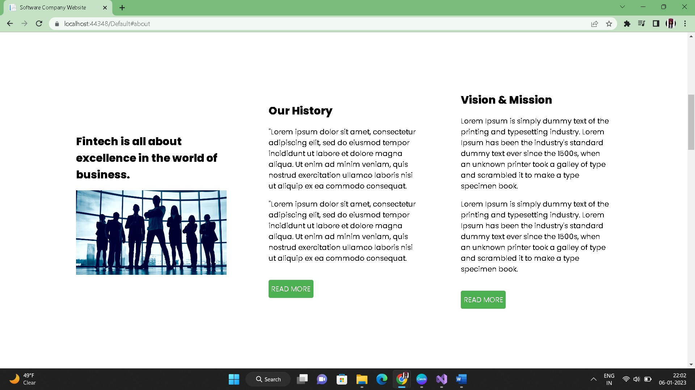
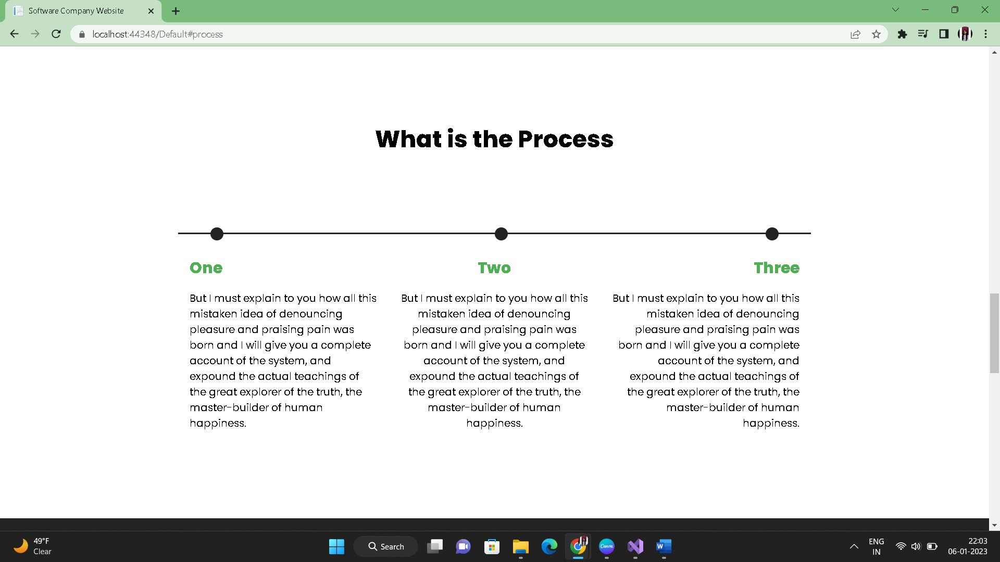
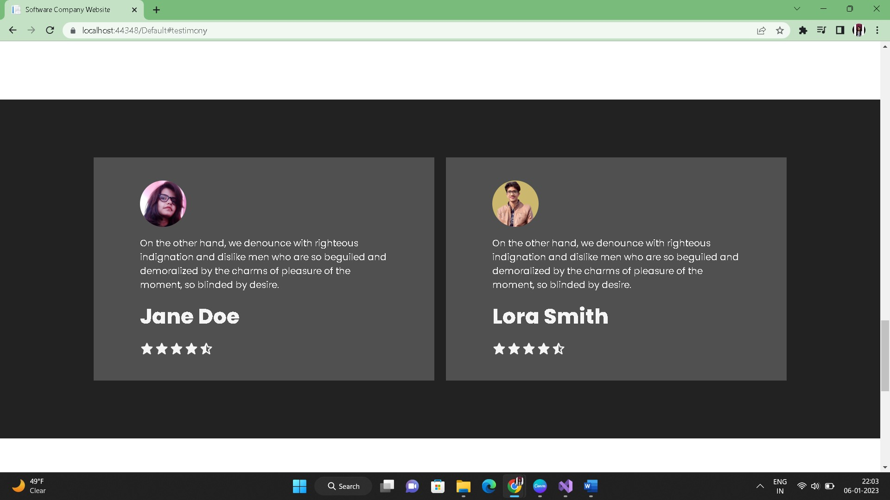
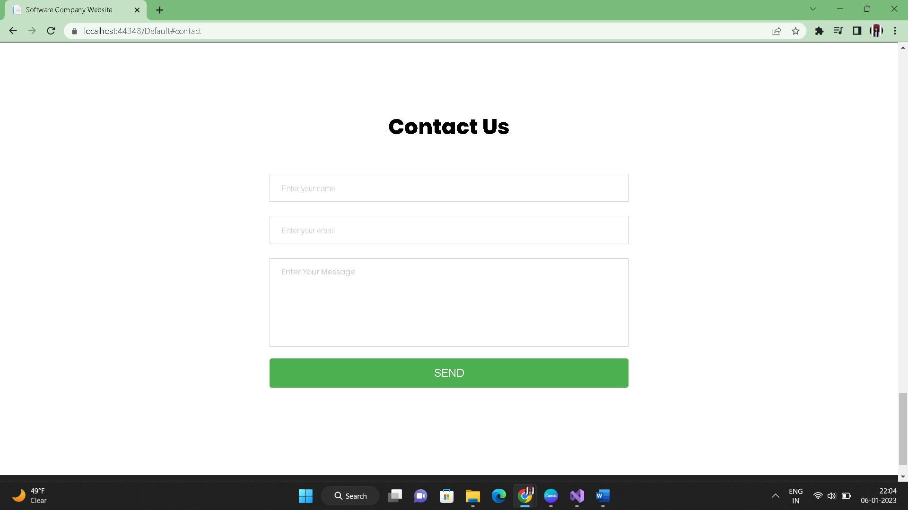
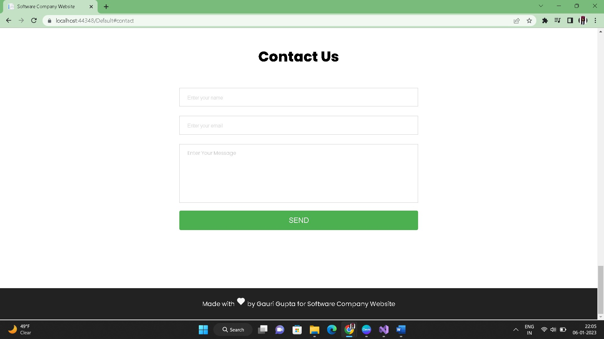

# SoftCompany

## Complete Responsive Software Website Website in asp.net .
- Asp.net
- HTML
- CSS
- JavaScript
- C#
- Webforms
- Visual Studio 2022

## Here are some insights of my project.

# Home Page

# About Page

# Process Page

# Testimony Page

# Contactus Page

# Footer Page

