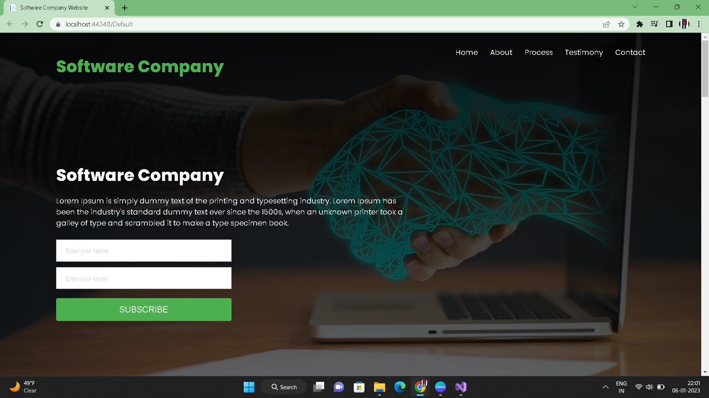

# SoftCompany

## Complete Responsive Software Website Website in asp.net .
- Asp.net
- HTML
- CSS
- JavaScript
- C#
- Webforms
- Visual Studio 2022

## Here are some insights of my project.

# Home Page

- The About Us page of website is an essential source of information for all who want to know more about your business.

 - About Us pages are where you showcase your history, what is unique about your work, your company’s values, and who you serve.

 - The design, written content, and visual or video elements together tell an important story about who you are and why you do it.

# About Page

# Process Page

# Testimony Page

# Contact Page

# Footer Page

